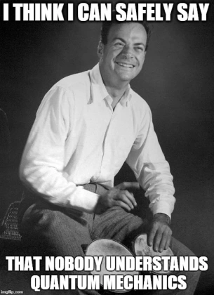

<!-- Banner (optional) -->

  

<h1 align="center">Hi there! 👋</h1>

  
  
  

---

## 👨‍🔬 About Me

I am a **4th year Ph.D. student** in the [Miranda-Quintana Group](https://github.com/mqcomplab) at the **University of Florida** 🐊.

My research focuses on **theoretical and computational chemistry**, with an emphasis on developing new wavefunction methods to tackle **strong correlation** and **perturbative expansions**.

Outside of research, I enjoy playing 🏀 **basketball** and going 🥾 **hiking**.

---

## ⚛️ Research Interests

- 💡 Strong electron correlation
- 🧮 Wavefunction methods & coupled cluster theory
- 🔬 Quantum algorithms for quantum chemistry
- 🧑‍💻 High-performance computing for large active spaces

---

## 📜 Favorite Quote

> *“If you think you understand quantum mechanics, you don’t understand quantum mechanics.”*  
> — Richard Feynman

---

  🚀 *Always excited to learn, collaborate, and explore the quantum world!*

